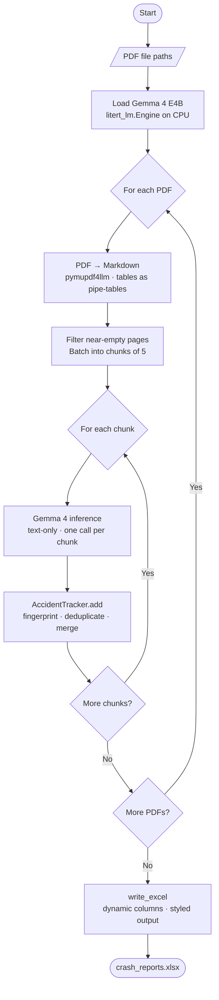

# Crash Report Generator — Pipeline Flow

---

## Component Breakdown

| Component | Library | Role |
|---|---|---|
| PDF → Markdown | `pymupdf4llm` | Converts pages to pipe-table Markdown; no images needed |
| LLM engine | `litert_lm` | Gemma 4 E4B on CPU; one conversation per chunk |
| Deduplication | `AccidentTracker` | Fingerprints crashes; merges duplicates across pages and PDFs |
| Excel writer | `openpyxl` | Dynamic columns, styled headers, auto-filter, frozen row |

---

## Key Design Decisions

- **Page batching** — up to 5 pages per LLM call; a 9-page report needs 2 calls instead of 9.
- **No images** — `pymupdf4llm` Markdown captures all table structure, eliminating image I/O and vision encoder overhead.
- **`AccidentTracker`** — fingerprints each crash on `report_number` / `date+location` / etc.; normal fields are first-wins, narrative fields get snippets appended.
- **Dynamic columns** — LLM picks snake_case field names freely; `_PREFERRED_ORDER` floats known fields to the front, unknowns sort alphabetically after.
