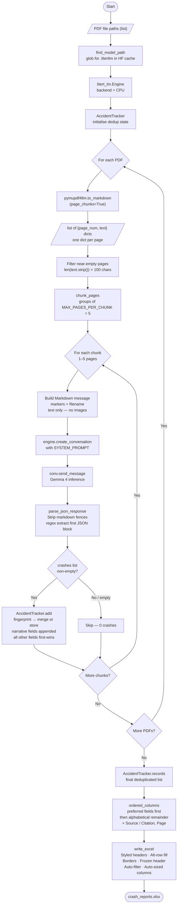

# Crash Report Generator — Pipeline Flow



---

## Component Breakdown

| Component | Tool / Library | Role |
|---|---|---|
| PDF → Markdown | `pymupdf4llm` | Converts each page to clean Markdown; tables become pipe-tables (`\| Label \| Value \|`) |
| LLM engine | `litert_lm.Engine` | Loads Gemma 4 E4B `.litertlm` on CPU |
| Conversation | `engine.create_conversation` | One context per chunk (up to 5 pages); system prompt injected each time |
| Inference | `conv.send_message` | Synchronous; returns full JSON response |
| JSON parser | `re` + `json` | Strips code fences, extracts first `{...}` block |
| Deduplication | `AccidentTracker` | Fingerprints each crash; merges duplicates on the fly across pages and PDFs |
| Excel writer | `openpyxl` | Dynamic columns, styled sheet, citation column, auto-filter |

---

## Speed Improvements over Original (per-page + images)

| Old approach | New approach | Gain |
|---|---|---|
| 1 LLM call per page | Up to 5 pages per LLM call | ~5× fewer calls |
| Raw text + embedded images (multimodal) | Markdown pipe-tables, text only | No image I/O or vision encoder overhead |
| Per-page dedup post-processing | `AccidentTracker` incremental merge | No second pass needed |
| Fixed 17-column schema | LLM chooses column names freely | Adapts to any report format |

---

## Excel Output Columns (Dynamic)

Columns are **not fixed** — the LLM picks snake_case names based on what it finds in each document. Known fields are floated to the front using `_PREFERRED_ORDER`; anything new goes alphabetically after them. Two columns are always appended at the end:

| Position | Column | Content |
|---|---|---|
| Front (if present) | `report_number`, `date`, `time`, `location`, `city`, `weather`, … | LLM-extracted crash fields |
| Alphabetical tail | any field not in `_PREFERRED_ORDER` | LLM-invented fields |
| Always last | **Source / Citation** | `filename.pdf, p.N–M` |
| Always last | **Page** | First page number of the chunk (integer) |

---

## Key Design Decisions

- **pymupdf4llm instead of fitz** — renders tables as `| Label | Value |` pipe-tables, giving the LLM structured input rather than ambiguous whitespace-delimited text. No images needed at all.
- **Page batching** — `chunk_pages()` groups up to 5 pages per LLM call. A 9-page report = 2 calls instead of 9.
- **Near-empty page filter** — pages with fewer than 100 characters are dropped before any inference, avoiding wasted LLM calls on cover pages or blanks.
- **`AccidentTracker` class** — fingerprints each crash (tries `report_number` → `case_number` → `date+time+location` → …). On a match: normal fields keep the first-seen value; narrative fields get unique snippets appended with ` | ` separator.
- **No images / no vision encoder** — `pymupdf4llm` Markdown captures all table data. This avoids temp file management, the `vision_backend` parameter issue (`INVALID_ARGUMENT` on multi-signature models), and image upload latency.
- **Version-safe metadata key** — pymupdf4llm ≤1.24 uses `"page"`, ≥1.27 uses `"page_number"` in chunk metadata. Code tries both with enumerate index as final fallback.
- **Dynamic columns** — the LLM is free to invent snake_case field names. `_PREFERRED_ORDER` floats well-known fields to the front of the Excel sheet; unknown fields sort alphabetically after them.
- **JSON fence stripping** — model may wrap its response in ` ```json ``` `; regex handles both fenced and bare JSON, falling back to `{"crashes": []}` on parse failure.
